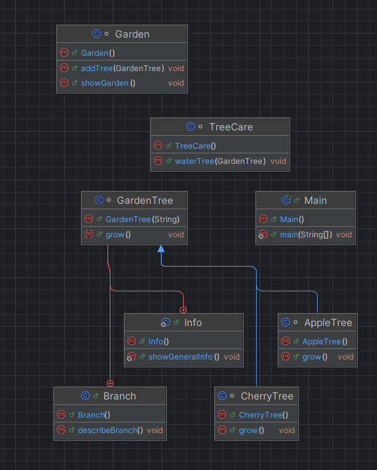

#  Садові дерева – Java OOP демонстрація

Цей проєкт демонструє використання **об'єктно-орієнтованого програмування** (ООП) у Java через приклад моделювання **садових дерев**.

---

##  Структура класів (UML)

